## About

### KEMP

With over 40,000 worldwide deployments and offices in America, Europe, Asia and South America, KEMP Technologies is the industry leader in advanced Layer 2 – 7 Application Delivery Controllers (ADC) and application-centric load balancing.

Since 2000, KEMP has been a consistent leader in innovation with a number of industry firsts, including high performance ADC appliance virtualization, application-centric SDN and NFV integration, innovative pricing and licensing models and true platform ubiquity that can scale to support enterprises of every size and workload requirement.

### Test Drive Description

The KEMP Azure Test Drive will walk you through the initial setup of a KEMP Virtual LoadMaster. You will configure a the LoadMaster to send traffic to two web-server replicas as well as KEMP’s Edge Security Pack (ESP) which provides security and pre-authentication access to the backend web services.

### KEMP Edge Security Pack (ESP)

As organizations rely more and more on web-based applications and a mobile workforce, the importance of secure application publishing continues to increase. A solution that provides edge security, SSO application integration and flexible authentication options is critical for optimal user experience and information security policy compliance. 

To address this need, KEMP Technologies continues to expand on the comprehensive features offered by the Edge Security Pack (ESP) which enhances the LoadMaster load balancer’s ability to secure public-facing applications and improve user experience. As more than just a Reverse Proxy, ESP includes some of the most common features that TMG users are familiar with including:

* End Point Authentication for Pre-Auth
* Persistent Logging and Reporting 
* Single Sign On across Virtual Services
* Active Directory Integration
* RADIUS Authentication Support
* Fully Customizable FBA Forms
* Soft Lockout
* Group Membership Validation
* Dual factor auth w/RSA SecurID

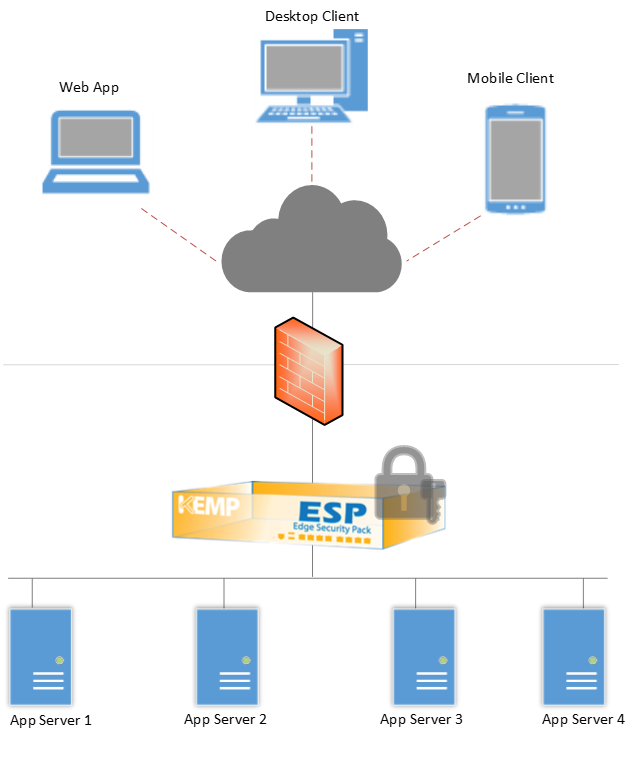

## Test Drive: Getting Started

### Licensing and accessing the LoadMaster

Once the Test Drive deployment completes use the provided URL, Username, and Password to access the LoadMaster.

1. Enter the provided URL into your browser. **You must use TCP Port 8443 to access the LoadMaster Web User Interface (WUI).**

*Example: https://vlmhoeeei2eds2boe.eastus.cloudapp.azure.com:8443*

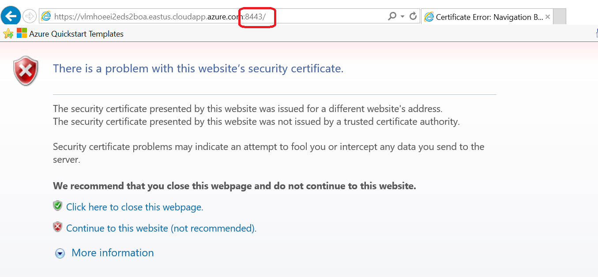
Select "Continue to this website (not recommended)"
Enter the provided username and password:

* Username: bal
* Password: Kemp@testdrive1

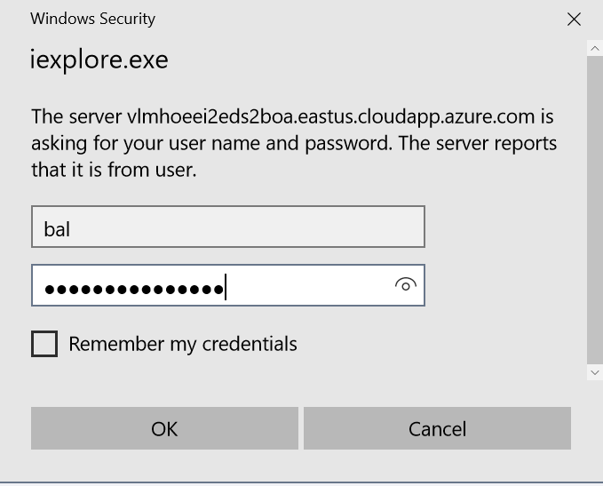

1. Scroll down and accept the LoadMaster End User License Agreement
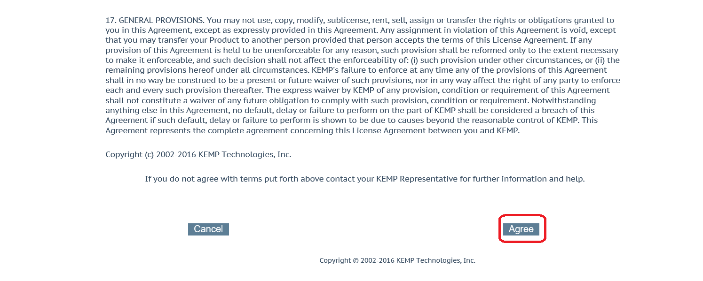

1. KEMP Loadmasters require a free KEMP ID to function. If you do not have a KEMP ID, you can create one by going to https://kemptechnologies.com/kemp-id-registration. **Use the promo-code "TESTDRIVE" when registering.**

1. Enter your KEMP ID to license the Free LoadMaster and click "License Now"
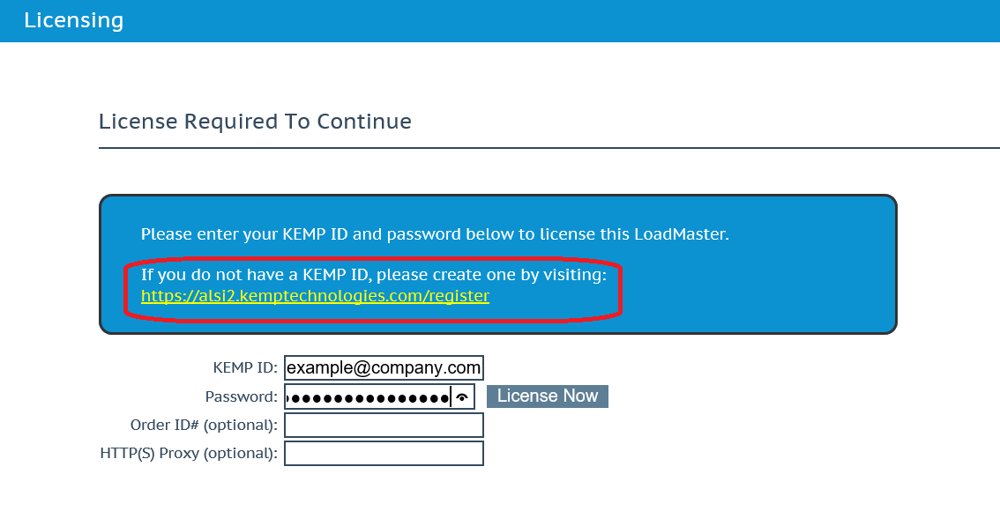

1. Select VLM-BYOL-FREE-Azure and click "Continue"
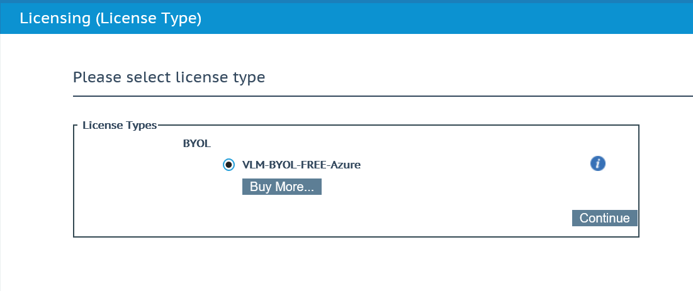

1. On the Allow Call Home page select "Allow"
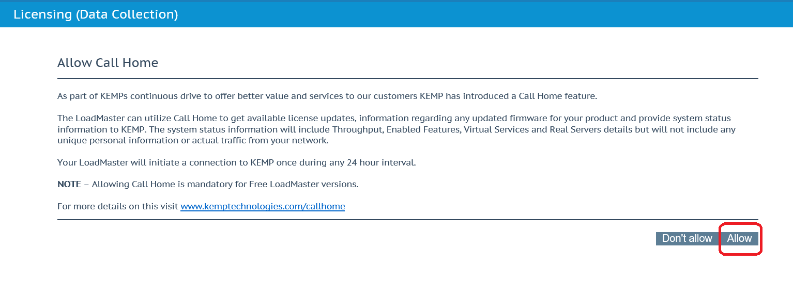

## LoadMaster Configuration

### Setting up a Virtual Service and Real Server

*Note: Configuration is only accessible after licensing.*

The Virtual Services on the LoadMaster defines the Virtual IP (VIP) address, port, protocol and Name.

1. In the left-hand navigation select Virtual Services and click Add New
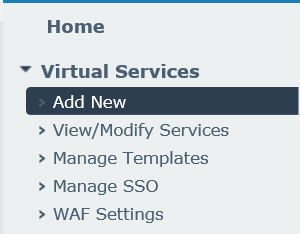

1. Enter a Name for the Virtual Service and click Add this Virtual Service. Leave the Virtual Address, Port, and Protocol as the defaults.
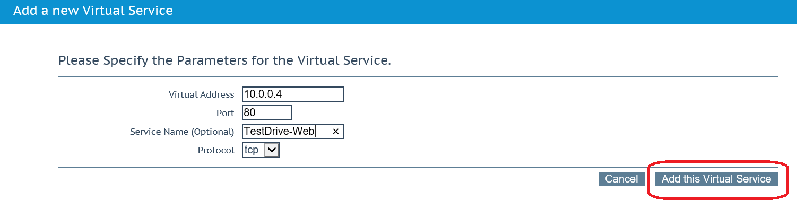
*For this step of the Test Drive all options and properties will remain unchanged.  Feel free to navigate through the Virtual Service options to familiarize yourself with the features and functions KEMP provides on the LoadMaster.*

1. Select Real Servers
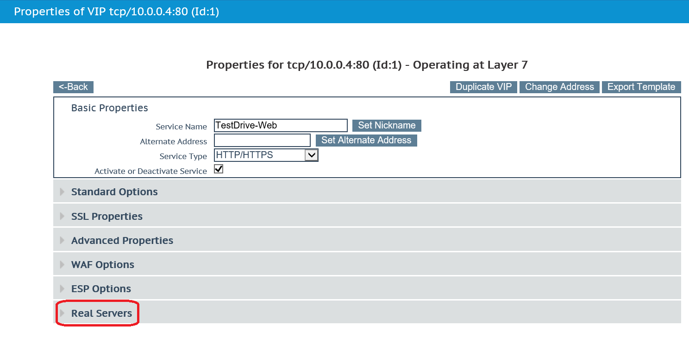

1. Select add new
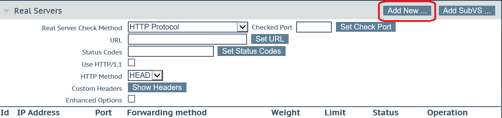

1. Under Real Server Address enter 10.0.0.10 and click Add This Real Server, then click OK
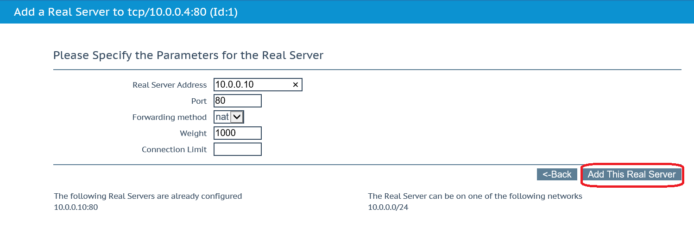

1. Under Real Server Address enter 10.0.0.11 and click Add this Real Server, then click OK
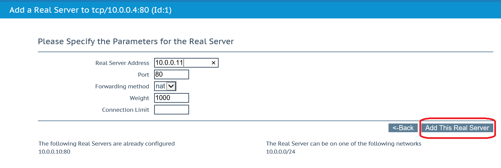

1. In the left-hand navigation, under Virtual Services click View/Modify Services
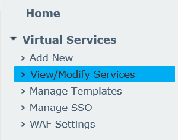

1. It will take a few seconds for validation of the Virtual Service to complete.  Once complete the Virtual Service Status will display UP with two healthy Real Servers.
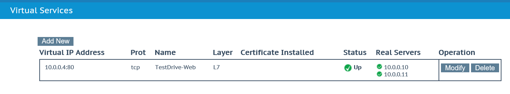

## Testing the configuration

### Testing the Virtual Service

*To test the functionality of the Virtual Service, use the same URL that was used to access the LoadMaster. This time the HTTP protocol will be used on port 80. Example: http://vlmhoeeei2eds2boe.eastus.cloudapp.azure.com*

1. Open your browser and navigate using the URL provided by your Test Drive.  The page below will be displayed in your browser.

1. On the KEMP LoadMaster left hand navigation select Statistics and Real Time Statistics
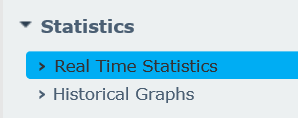

1. Click through the Global, Real Servers, Virtual Services, Connections, Bytes, Bits, and Packets to see the statistical information provided by the KEMP LoadMaster.
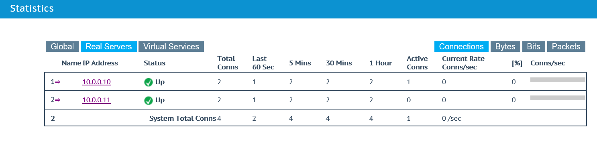

## Configuring KEMP Edge Security Pack (ESP)

*Now that the Virtual Service is configured and tested, the Edge Security Pack functionality can be added to secure the backend web application.*

Note: In this Test Drive environment RADIUS Authentication will be used but several other methods are available, such as LDAP (Active Directory), Certificates, and RSA-SecureID. For more information see the [KEMP Edge Security Pack](https://kemptechnologies.com/microsoft-load-balancing/microsoft-forefront-tmg-replacement/) page.

1. In the LoadMaster left hand navigation, select Virtual Services and select Manage SSO
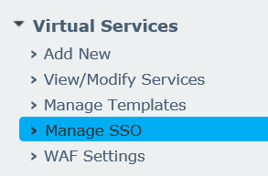

1. Under Client Side Single Sign on Configurations, enter a name for the SSO domain and click Add
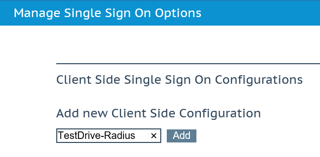

1. Configure the Single Sign on Domain with the following settings. Select the button to the right of each field to apply each setting.

  * Authentication Protocol = Radius
  * RADIUS Server(s) = 10.0.0.5
  * RADIUS Shared Secret (case sensitive) = testdrivesecret
  * Domain/ Realm (case sensitive) = testdrive.com 
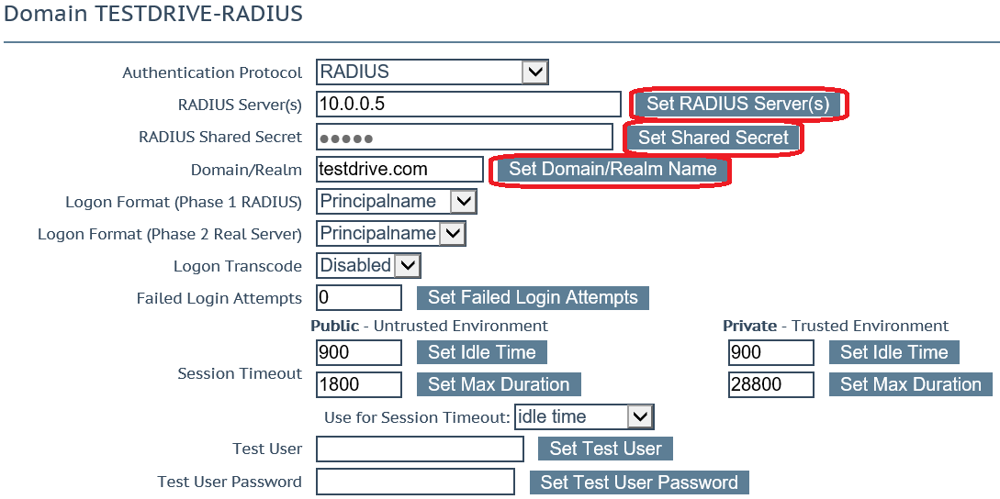

1. In the LoadMaster left hand navigation, select View/Modify Services
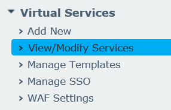

1. Select Modify on the Test Drive Virtual Service
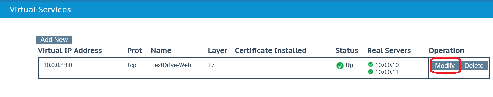

1. Select ESP Options and tick the Enable ESP box
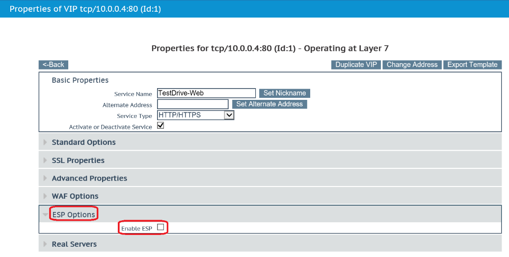

1. Configure the ESP Options with the following settings. Click the button to the right of each field to apply each setting.

  * Client Authentication Mode = Forms Based
  * SSO Domain = Select the name of the SSO domain created earlier
  * Allowed Virtual Directories = Enter the unique URL provided by your Test Drive
  * Allow Virtual Directories = /\*
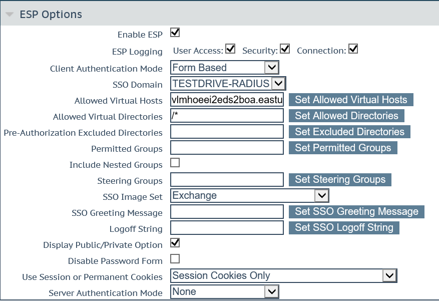

